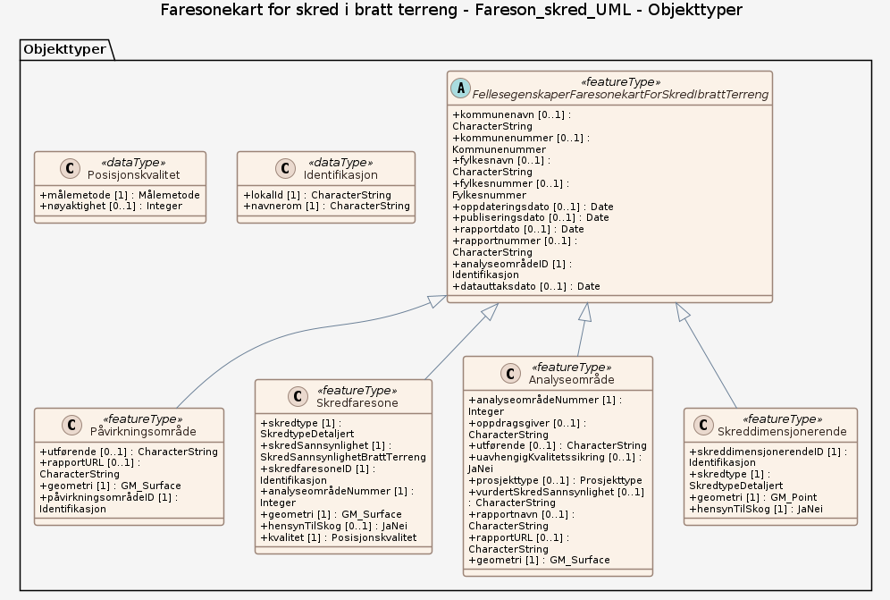

# Produktspesifikasjon: Faresonekart for skred i bratt terreng

*«Faresonekart for skred i bratt terreng» består av detaljerte skredfareutredninger/-kartlegginger som skal avdekke den reelle skredfaren og dokumentere om et område oppfyller sikkerhetskravene i Byggteknisk forskrift (TEK17 § 7-3) (https://www.dibk.no/regelverk/byggteknisk-forskrift-tek17/7/7-3/). Skredfaren kvantifiseres som nominell årlig sannsynlighet (≥1/100, ≥1/1000 og ≥1/5000) og presenteres i et faresonekart, med tilhørende skredfarerapport. 

Datasettet er en sammenstilling av prosjekter utført av eller for NVE, samt av andre aktører som har fulgt NVEs veileder "Utredning av sikkerhet mot skred i bratt terreng": <https://veiledere.nve.no/utredning-av-sikkerhet-mot-skred-i-bratt-terreng/hvordan-utfore-en-skredfareutredning/> (UKS).
Veilederen dekker kartlegging av skredtypene steinsprang-, stein-, snø-, sørpe-, jord- og flomskred. 

Datasettet inneholder også eldre rapporter/faresoner som ikke nødvendigvis oppfyller dagens veileder/krav.

NVE kartlegger utvalgte områder prioritert etter "Plan for skredfarekartlegging" (https://publikasjoner.nve.no/rapport/2011/rapport2011_14.pdf), med hovedvekt på eksisterende bebyggelse og områder der mennesker oppholder seg. Det finnes en kartbasert oversikt (https://nve.maps.arcgis.com/apps/webappviewer/index.html?id=2e2412461a9d4ef6ac370edaa09a0a1e) over hvilke kommuner som er eller skal bli kartlagt i statlig regi. I tillegg utføres mange kartlegginger av konsulenter for kommuner, offentlige etater, private selskaper og privatpersoner, ofte som grunnlag for plan- og byggesaker. For enkelte områder er kun én faresone tilgjengelig (f.eks. 1000-årsfaresone), typisk når utredningen gjelder en spesifikk sikkerhetsklasse. Etter innføring av pliktig innmelding av grunnundersøkelser og naturfareutredninger fra 01.01.2025, har tilfanget av faresonekart økt betydelig.

Eksterne utredninger der NVE ikke er oppdragsgiver blir kun tilrettelagt for kart-presentasjon av NVE. NVE har ikke vurdert den faglige kvaliteten eller datagrunnlaget. Bruk av data og rapporter skjer derfor på eget ansvar og NVE fraskriver seg ansvar for feil og mangler i rapportene og i de digitale dataene. Det er en forutsetning at tilhørende rapporter gjennomgås nøye før faresoner tas i bruk, og at brukeren, eventuelt ved hjelp av konsulent, vurderer kvalitet og egnethet for formålet.

Datasettet erstatter tidligere datasett  "Skredfaresoner" 
Viktigste nyheter er:
Nye objekttyper: Påvirkningsområde og Skreddimensjonerende (punkt for visuell visning av skredtype)
Ny egenskap: HensynTilSkog (ja/nei), gir info om faresoner kartlagt uten hensyn til dagens skog.
Nye tegneregler (WMS) for punktene over og mulighet for detaljert visning av faresoner for hver enkelt skredtype. Det er fortsatt visning av faresoner over samlet skredfare for alle skredtyper i bratt terreng.*

**Nøkkelord:** Skred, Faresoner, Skredfaresoner, Farekart, Skredfareområder, Fastlands-Norge med øyer, Områder med naturbetingede farer, Samfunnssikkerhet, Påvirkningsområde, Skredfaresone, Analyseområde, Skreddimensjonerende, utførende, rapportURL, skredtype, skredSannsynlighet, analyseområdeNummer, hensynTilSkog, uavhengigKvalitetssikring, vurdertSkredSannsynlighet, rapportnavn, rapportdato

**Emnekategorier:** Geovitenskapelig informasjon

**Geografisk utstrekning**:

- **Vest**: 2.0
- **Øst**: 33.0
- **Sør**: 57.0
- **Nord**: 72.0

**Tidsmessig utstrekning**:

- **Tidsperiode**:
  - **Fra**: 2026-01-21
  - **Til**: 2026-01-21

## Om spesifikasjonen

> **Denne versjonen av produktspesifikasjonen:**  
> **Opprettet dato:** 2026-01-21 
> **Endret dato:**  
> **Språk:** nor 
> **Kontaktinformasjon:** Norges vassdrags- og energidirektorat, [gisstotte@nve.no](mailto:gisstotte@nve.no)

## Om produktet Faresonekart for skred i bratt terreng

> **Romlig representasjonstype:** Vektor 
> **Unik identifikator:** d4a61153-3a21-4593-900c-1587b5b1c42d 
> **Kontaktinformasjon:** Norges vassdrags- og energidirektorat, [gisstotte@nve.no](mailto:gisstotte@nve.no)
>
> **Romlig oppløsning:**
>
> **Ekvivalent målestokk**: 5000
>
> **Begrensninger:**
>
> **Juridiske begrensninger**:
>
> - **Tilgangsbegrensninger**: Åpne data
> - **Bruksbegrensninger**: Lisens
> - **Lisens**: Norsk lisens for offentlige data (NLOD)
> - **Lisenslenke**: <http://data.norge.no/nlod/no/1.0>

### Formål

Faresonekart for skred i bratt terreng har som overordnet formål å redusere risikoen ved skred. Kartene viser hvilke områder som har skredfare og hvilke som er antatt trygge, basert på angitt nominell årlig sannsynlighet i henhold til kravene i TEK17 § 7-3 Sikkerhet mot skred. Dette gir et viktig grunnlag for å sikre trygg arealbruk og forebygge skade på liv, helse og verdier.

Skredfaresoner skal dekke de mest skredutsatte områdene der det bor mennesker i Norge og Spitsbergen.

### Bruksområde

Faresonekartene brukes primært innen arealplanlegging og byggesaksbehandling, samt i beredskapsarbeid og som grunnlag for sikringstiltak mot skred. Hovedmålgruppen er kommunale og private arealplanleggere, samt saksbehandlere på kommunalt, regionalt og statlig nivå som arbeider med beredskap, arealplan og byggesak. Kartene er også sentrale i NVEs arbeid med arealplaner, skredsikring og beredskap. I beredskapssammenheng kan de benyttes både til planlegging og til vurderinger under akutte hendelser.

Den nye karttjenesten gir en mer detaljert visning, med mulighet til å se faresoner for hver enkelt skredtype (der dette er tilgjengelig), i tillegg til samlede skredfaresoner. 
Tjenesten gjør det også mulig å vise skredfaresoner uten hensyn til dagens skog. 
Tjenesten skiller, gjennom forskjellig farge på Kartleggingsområde (analyseområde), på visning mellom faresonekart med og uten gjennomført uavhengig kvalitetssikring (UKS).

 Hvilke faresoner som bør brukes, avhenger av formålet:

Plan- og byggesaker:
Kommunene skal bruke skredfaresoner som viser samlet skredfare i plan- og byggesaksarbeid.

Kommunal planlegging knyttet til skog:
Det kan være hensiktsmessig å bruke skredfaresoner uten hensyn til dagens skog, dersom kommunen ikke legger begrensninger på hogst i skogområder som påvirker skredfare.

Beredskap:
For beredskapsarbeid kan det være nyttig å se på faresonene for hver enkelt skredtype for å få bedre innsikt i hvilke prosesser som kan dominere ved ulike hendelser.

Sikringstiltak:
Ved vurdering eller prosjektering av sikringstiltak er faresoner for hver enkelt skredtype spesielt relevante.

## Omfang

### Hele datasettet

**Nivå**: dataset

**Nivåbeskrivelse**: Gjelder hele datasettet. Hvis omfang ikke er oppgitt under en overskrift, gjelder teksten for hele datasettet og alle leveranser

### Fareson_skred_UML

**Nivå**: dataset

**Nivåbeskrivelse**: Fra SOSI UML-modell

## Datainnhold og struktur

### Datamodell - Fareson_skred_UML

➡️ [Se full datamodell for omfang "Fareson_skred_UML" (diagram per pakke og objektkatalog)](fareson-skred-uml/objektkatalog.html)

## Datakvalitet

**Nivå**: dataset

**Kvalitetsmål**: SOSI produktspesifikasjon: Faresonekart for skred i bratt terreng

- **Beskrivende resultat**: Dataene er ikke vurdert iht produktspesifikasjonen

**Kvalitetsmål**: Prosentvis dekning i forhold til datasettets utstrekning

- **Målebeskrivelse**: Datasettets faktiske kartlagte areal i forhold til datasettets spesifiserte utstrekning
- **Resultat**: 1

## Datafangst og produksjon

**Datainnsamling og prosessering**:

- **Prosesstrinn**:
  - **Beskrivelse**:
    I en faresonekartlegging for skred i bratt terreng vurderer man de faktiske forhold. For vurderingen av reell skredfare benytter man detaljerte terrengmodeller, informasjon om lokal geologi og geomorfologi og andre observasjoner gjort gjennom feltbefaring. Tidligere skredhendelser i området og mer avanserte utløpsmodeller for skred er også av betydelse for utstrekning av faresonene. De ulike skredtypene krever litt ulike grunnlagsdata og beregningsmetodikk for å produsere faresoner. Mer informasjon om hvordan de ulike skredtypene blir vurdert og kartlagt finnes via NVEs veileder for "Utredning av sikkerhet mot skred i bratt terreng": <https://veiledere.nve.no/utredning-av-sikkerhet-mot-skred-i-bratt-terreng/>

    Datasettet gir ikke en komplett oversikt over alle faresonekart for skred i bratt terreng, dvs. det finnes skredfareutredninger med eller uten faresoner som ikke fremkommer i denne tjenesten.
    Skredfarekartlegginger gjennomført av NVE inngår i NVEs program for farekartlegging, og disse dataene oppdateres i henhold til gjeldende prioriteringslister for skredfarekartlegging og etter gjennomført sikringstiltak. Samtidig vil datasettet jevnlig, pga. lovkrav om pliktig innmelding av naturefareutredninger, bli oppdatert med skredfareutredninger som blir meldt inn til NVE gjennom NVEs innmeldingsløsning.

## Vedlikehold

**Vedlikeholdsfrekvens**: Kontinuerlig

**Status**: Kontinuerlig oppdatert

## Presentasjon

**navn**: Tegneregler

**Lenke**:
<https://register.geonorge.no/tegneregler/faresonekart-for-skred-i-bratt-terreng>

## Leveranse

| Tjeneste | Endepunkt | Type | Format | Leveranseenheter |
| --- | --- | --- | --- | --- |
| WMS-tjeneste | [Lenke](https://kart.nve.no/enterprise/services/Skredfaresoner3/MapServer/WMSServer?request=GetCapabilities&service=WMS) | OGC:WMS | GeoJSON, GeoJson |  |
| REST-API | [Lenke](https://kart.nve.no/enterprise/rest/services/Skredfaresoner3/MapServer) | W3C:REST | GeoJSON |  |
| GeoPackage: fareson-skred-uml | [Lenke](https://raw.githubusercontent.com/larsingea/ps_demo/main/produktspesifikasjon/faresonekart-for-skred-i-bratt-terreng/fareson-skred-uml/fareson-skred-uml.gpkg) | Nedlasting | GPKG |  |

## Metadata

**Metadatastandard**: ISO19115

**Metadatastandardversjon**: 2003

**Metadatadato**: 2026-09-18

**språk**: nor

**Kontakt**:

- **Organisasjon**: Norges vassdrags- og energidirektorat
- **Logo**: <https://register.geonorge.no/data/organizations/970205039_NVE_liten.png>
- **Epost**: gisstotte@nve.no
- **rolle**: pointOfContact

**Metadataidentifikator**:

- **Utsteder**: Geonorge
- **kode**: d4a61153-3a21-4593-900c-1587b5b1c42d
- **koderom**: <https://kartkatalog.geonorge.no/metadata/>
- **Metadatalenke**: <https://kartkatalog.geonorge.no/metadata/d4a61153-3a21-4593-900c-1587b5b1c42d>

## Tilleggsinformasjon

- **Produktark:** [https://register.geonorge.no/produktark/faresonekart-for-skred-i-bratt-terreng](https://register.geonorge.no/produktark/faresonekart-for-skred-i-bratt-terreng)
- **Produktside:** [https://www.nve.no/naturfare/utredning-av-naturfare/om-kart-og-kartlegging-av-naturfare/om-kartlegging-av-skredfare-i-bratt-terreng/](https://www.nve.no/naturfare/utredning-av-naturfare/om-kart-og-kartlegging-av-naturfare/om-kartlegging-av-skredfare-i-bratt-terreng/)
